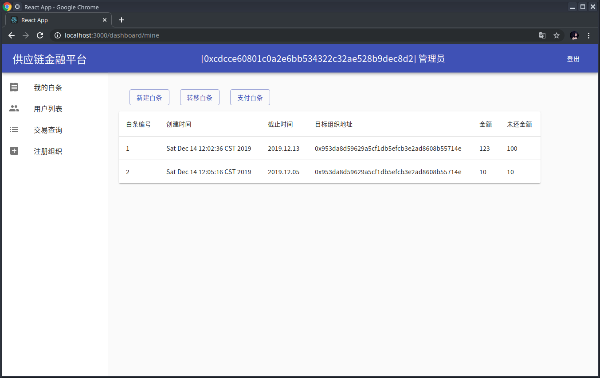
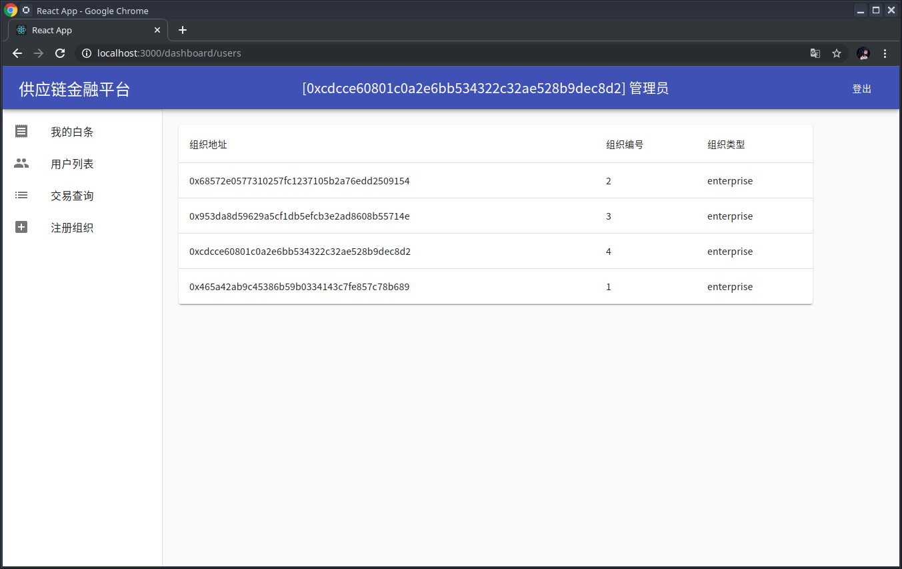
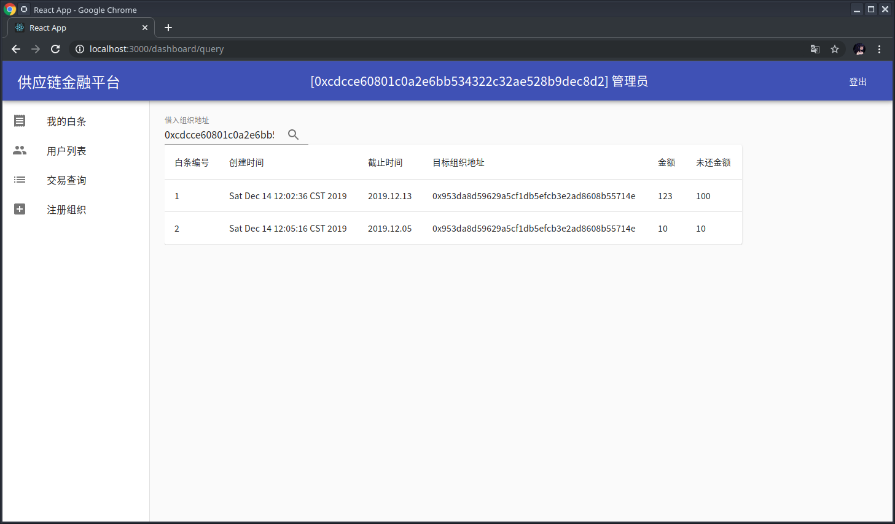
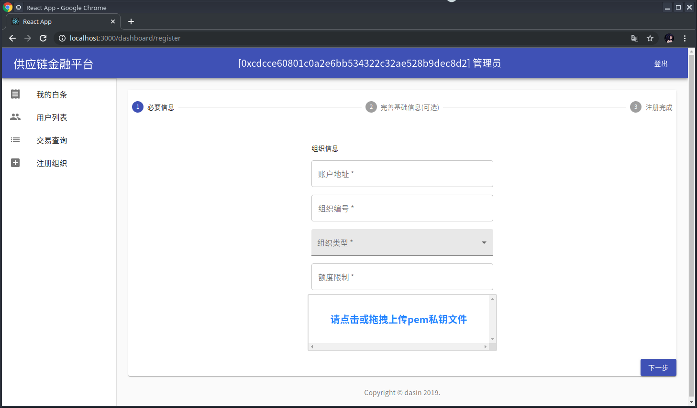

# 供应链金融平台

SYSU 2019 区块链课程 期末作业

> 真实报告存放在`doc/report.md`

## 预览









## 构建和运行

### 后端 (`backend`目录)

在运行之前请先手动将`src/test/resources/contract/Supply.sol`部署到链上，并将部署者PEM私钥放入`src/main/resources`，并修改同目录中`application.yml`的`accounts.pem-file`字段。

由于注册新组织需要将私钥存入mysql，所以还需设置`application.yml`中的`spring.datasource.password`字段

#### 运行

```bash
cd backend
./gradlew build
java -jar build/libs/backend-0.0.1-SNAPSHOT.jar
```

### 前端(`frontend`目录)

```bash
    cd frontend
    yarn
    yarn start
```

请用浏览器访问`http://localhost:3000`，并用上述管理员账号地址登录。

