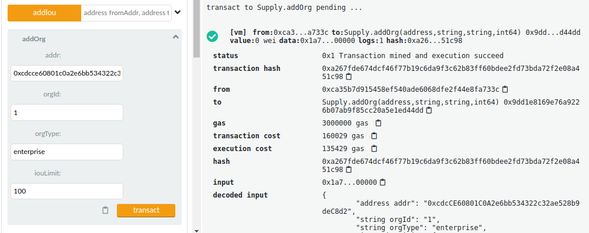

# 中山大学数据科学与计算机学院本科生实验报告

(2019年秋季学期)

课程名称:区块链原理与技术

任课教师:郑子彬

| 年级     | 大三        | 专业(方向) | 软件工程         |
| -------- | ----------- | ---------- | ---------------- |
| 学号     | 17343069    | 姓名       | 梁赛波           |
| 电话     | 13326052735 | Email      | 399359237@qq.com |
| 开始日期 | 2019.12.7   | 完成日期   | 2019.12.13       |

## 项目背景

> 发展开源区块链技术的深远意义已不言而喻，但技术路线的选择也至关重要。虽然最原始的区块链技术起源于虚拟货币及公有链项目，但公有链的项目方往往以融资为目的，其用户则是以价格交易获利为目标，导致各方更多是关注币价的涨跌而非区块链的真正应用能力。由于公有链的代币实质上是“类货币”与“类证券”，已经被中国的监管部门严厉叫停。当潮水退去、大浪淘沙后，联盟链技术已肩负起推动区块链技术继续前行的重任。2018年，业界更是提出“公众联盟链”的发展路线，呼吁联盟链应该积极开放开源，从较为封闭的联盟内或公司内走向大众，让普罗大众真正感受到区块链带来的体验提升、效率提升、成本下降、信任增强、数据互换、责任追溯等好处，实现分布式商业的愿景。

> 新一代的公众联盟链，对区块链底层技术提出了新的要求，除标准的区块链特性之外，还有几个方面仍需重点加强：首先，由于公众联盟链并非单一链条，所以需具备支持多链并行以及跨链通信的技术，同时需能够支撑来自互联网海量交易请求的能力。其次，需具备快速、低成本地组建联盟和建链的能力，以便于各需求方高效建立联盟链网络，让企业间建链合作变得像建立“聊天群”一样高效便捷。最后，需要开源和开放，实现联盟成员间的充分信任。公众联盟链有利于降低企业快速试错的成本，有效提升商业上的容错性，也促进商业社会朝着可信化、透明化的方向深化发展，全面降低由于合作带来的操作、道德、信用、信息保护等方面的风险。

比如以下现实场景

> 某车企(宝马)因为其造车技术特别牛,消费者口碑好,所以其在同行业中占据绝对优势
> 地位。因此,在金融机构(银行)对该车企的信用评级将很高,认为他有很大的风险承担的
> 能力。在某次交易中,该车企从轮胎公司购买了一批轮胎,但由于资金暂时短缺向轮胎公司
> 签订了 1000 万的应收账款单据,承诺 1 年后归还轮胎公司 1000 万。这个过程可以拉上金
> 融机构例如银行来对这笔交易作见证,确认这笔交易的真实性。在接下里的几个月里,轮胎
> 公司因为资金短缺需要融资,这个时候它可以凭借跟某车企签订的应收账款单据向金融结构借款,金融机构认可该车企(核心企业)的还款能力,因此愿意借款给轮胎公司。但是,这
> 样的信任关系并不会往下游传递。在某个交易中,轮胎公司从轮毂公司购买了一批轮毂,但
> 由于租金暂时短缺向轮胎公司签订了 500 万的应收账款单据,承诺 1 年后归还轮胎公司 500万。当轮毂公司想利用这个应收账款单据向金融机构借款融资的时候,金融机构因为不认可轮胎公司的还款能力,需要对轮胎公司进行详细的信用分析以评估其还款能力同时验证应收账款单据的真实性,才能决定是否借款给轮毂公司。这个过程将增加很多经济成本,而这个问题主要是由于该车企的信用无法在整个供应链中传递以及交易信息不透明化所导致的。

一定范围内的信息共享对传统的商业活动能够针对供应链上小微企业融资难的困境，依托区块链上核心企业的信任传递，围绕核心企业及上下游多级供应链企业，并借助银行、保兑机构等服务商共同打造供应链金融产业生态闭环，从数字资产、产融平台、商业信用等多个方面打造全新供应链金融生态体系，促进多方企业互利共生，促进整个生态良性发展。

在这学期的区块链课程中，在一些区块链从业者和老师、师兄的引导下我得知了`fisco-bcos`正是在这种需求下产生的一款优秀区块链底层平台，而且在代码开源的背景下有详细的项目文档，为区块链开发者提供了极大的方便。

## 方案设计

整个项目分为web前端，solidity链端和引入fisco-bcos java sdk编写的java后端

由于项目规模不大，所以没有部署多个节点，故直接使用`sdk`证书

### 数据流向

联盟中的每个成员都在本地搭建前后端服务，通过公开的平台合约地址以及管理员（平台合约的部署者）分发的账号对链上合约进行访问。


本来下意识的打算在链上存储一些关键信息，具体查询通过后端访问数据库来做。

不过感觉这样不够去中心化，所以重写了一下干脆把服务端分发下去。

### 功能实现

+ 只有管理员有注册新组织和修改信息的权限

  ```
  address public owner = msg.sender;
  
  modifier byAdmin {
  	require(msg.sender == owner);
  	_;
  }
  ```

+ 每个组织（联盟成员）有初始白条额度`iouLimit`, 由于存在上一条规则，这一额度对于用户是只读的，而管理员的创建和修改操作会直接上链，保证过程公开

+ 新建白条

  ```
  function addIou(address fromAddr, address toAddr, string memory createTime, int64 amount, string memory due) public returns (int64) {
          // not empty
          require(isValidAddr(fromAddr));
          require(isValidAddr(toAddr));
          // renter proposes
          require(msg.sender == fromAddr);
          // enough iouLimit
          require(org_store[msg.sender].iouLimit >= amount);
  
          iou_count += 1;
          iou_store[iou_count] = Iou(iou_count, fromAddr, toAddr, createTime, amount, amount, due);
          org_store[fromAddr].iouLimit -= amount;
          org_store[fromAddr].outIous.push(iou_count);
          org_store[toAddr].inIous.push(iou_count);
          emit IouCreation(iou_count, fromAddr, toAddr, amount, due);
          return iou_count;
      }
  ```

  在执行之前进行一些简单的判断，比如白条双方地址合法，白条拥有者有足够的额度

+ 一般意义上的白条转移分成**分裂**和**转移借出方/借入方**。

+ 对于每个成员维护所有和他有关的白条列表

  ```
  struct Organization {
          address addr;
          string orgId;
          string orgType;
          int64 iouLimit;
          int64[] outIous;
          int64[] inIous;
      }
  ```

  在编码过程中我发现这是一个非常常用的需求，所以花费一些空间存储它们。

## 功能测试

用两个账户建立两个组织

0xcdcce60801c0a2e6bb534322c32ae528b9dec8d2

0x953da8d59629a5cf1db5efcb3e2ad8608b55714e



上链之后可以获取组织信息


但此时不能创建白条，因为白条创建者必须是借入方


查看原始合约的from字段

0xca35b7d915458ef540ade6068dfe2f44e8fa733c

将该账户上链


此时可以调用`addIou`创建白条


也可以支付这个白条，可以在右侧看到白条剩余金额变成50-30=20


分裂白条也如预期


## 界面展示


## 心得体会

这次实验让我对区块链应用有了一个具体的理解，原来半懂不懂的概念比如公钥私钥、账户、节点在区块链应用中扮演什么样的角色也有了了解。

也发现了区块链项目和传统的前后端项目有哪些不同，原来一直以为区块链链端就是一个开放读权限的公共数据库，但是实际花了一些时间编写代码之后，发现区块链底层平台完全可以作为一个独立完整的开发环境。
